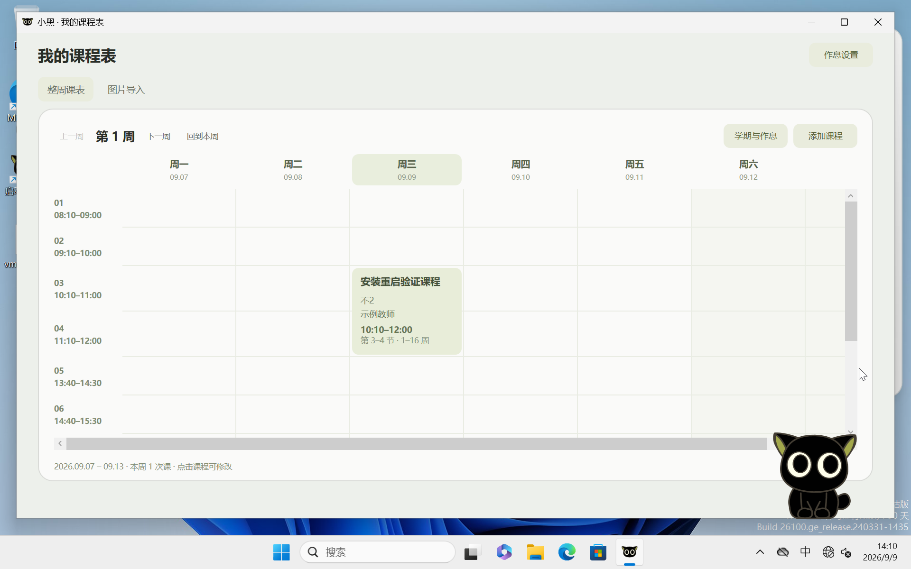

# 罗小黑 · 桌面伙伴

让小黑陪在桌面上。忙的时候安静陪伴，空下来记点想法，也帮你记住待办和下一节课。

**[下载 Windows 安装包](https://github.com/lanziyi36-eng/luo-xiaohei-desktop/releases/latest/download/Xiaohei-Setup-0.2.37-win-x64.exe)** · [开始使用](docs/GETTING-STARTED.md) · [常见问题](docs/FAQ.md) · [反馈问题](https://github.com/lanziyi36-eng/luo-xiaohei-desktop/issues/new/choose)

当前版本 **0.2.37** · **Windows 11 x64** · 本机保存 · 离线识别

> **首次下载／安装：遇到提示时，需要手动确认信任文件。**
>
> 当前安装包尚未代码签名。确认下载来自本仓库的 Release 后，按下面操作：
> - **Edge 提示“通常不会下载”**：打开下载列表，点击文件旁的 **“…” → “保留”**；如有二次确认，展开 **“显示详细信息”**（如出现），选择 **“仍然保留”**。
> - **Windows 提示“Windows 已保护你的电脑”**：点击 **“更多信息” → “仍要运行”**，即可进入安装。

## 和小黑一起

| 日常陪伴 | 随手安排 |
| --- | --- |
| 猫形与人形自由切换，拖动时播放跑动动画 | 随手记下想法，搜索、编辑，也能导出 |
| 眨眼、看向光标，偶尔伸懒腰或想一想 | 给待办设置时间，到点提醒，支持稍后再提醒 |
| 全屏或演示时安静陪伴，保留轻微动作 | 查看今日与整周课表，提前知道下一节是什么、在哪上 |

课表可以从图片导入，识别后核对再保存；上课时间、课间和特殊间隔都能自己设置。

## 三步开始

1. 下载上方安装包，双击运行。
2. 选择是否创建桌面快捷方式、是否登录自动启动，点击安装。
3. 从桌面“启动罗小黑”打开，**左键单击小黑进入菜单，按住左键拖动**。

运行库、动画和 OCR 模型已经包含，无需编译或另行下载。其他问题见[安装与下载说明](docs/FAQ.md#安装与下载)。

目前提供 Windows 11 x64 安装版。**macOS 暂不支持**；Windows 10 和 Windows ARM 设备尚未完成适配验证。

## 你的记录，留在你的电脑里

无需注册账号。笔记、待办、课程和作息保存在本机，课表图片识别也在本机完成。升级与卸载会保留个人记录，换电脑前可以[完整备份](docs/FAQ.md#备份与更新)。

提醒需要小黑运行；图片中的小字或复杂排版可能需要手工纠正。

[查看更新记录](CHANGELOG.md) · [所有版本与校验文件](https://github.com/lanziyi36-eng/luo-xiaohei-desktop/releases) · [数据说明](docs/PRIVACY.md) · [角色与第三方声明](NOTICE.md)

这是产品下载与反馈仓库。安装请选择 Release 中的 **`.exe`**；页面上的 **Source code ZIP** 仅包含本仓库的说明文档，不是应用程序。
